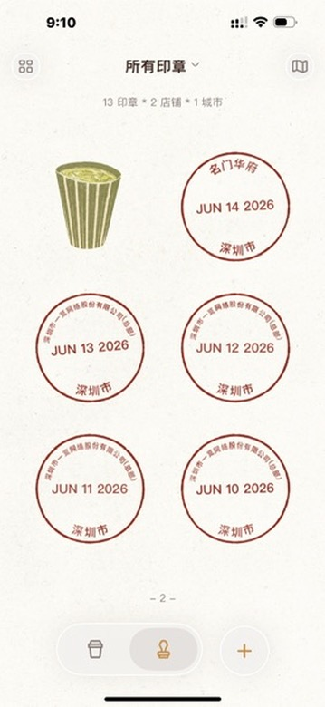
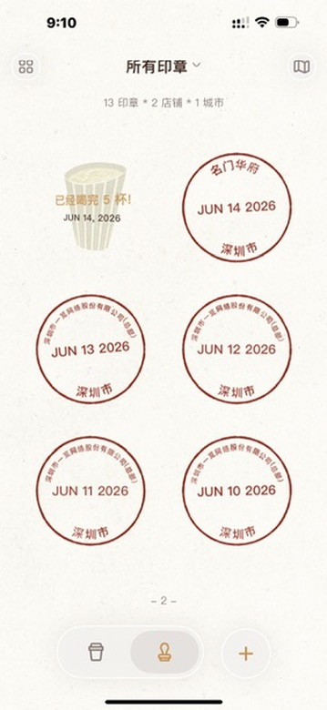
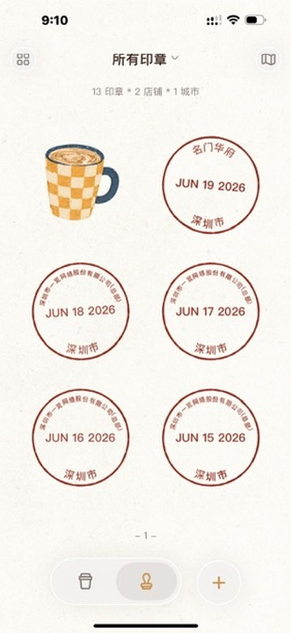

# 勋章馆页面设计文档

## 设计概述

勋章馆页面展示用户获得的勋章成就，激励用户持续打卡记录饮品。

### 设计图





---

## 页面结构

### 1. 顶部导航栏

```
┌─────────────────────────────────────┐
│  [<]      勋章馆          [?]       │
└─────────────────────────────────────┘
```

- 高度：88px（含状态栏 44px）
- 背景：毛玻璃效果 (blur 20px)
- 左侧：返回按钮
- 中间：页面标题 "勋章馆"
- 右侧：帮助按钮

### 2. 统计卡片

```
┌─────────────────────────────────────┐
│                                     │
│  8 枚已获勋章              🏅       │
│  ✓ 打卡总数: 125                    │
│                                     │
│                          ○ (装饰圆) │
└─────────────────────────────────────┘
```

- 显示已获得勋章数量（大字体高亮）
- 显示打卡总数（标签样式）
- 右侧勋章图标（渐变圆形背景）
- 装饰性圆形元素

### 3. 探索足迹卡片

```
┌─────────────────────────────────────┐
│  🗺️  探索足迹                       │
│      已点亮 5 个城市 · 3 个商圈     │
│                            [头像]   │
└─────────────────────────────────────┘
```

- 左侧地图图标
- 中间：标题 + 描述
- 右侧：城市头像堆叠

### 4. 即将达成横幅

```
┌─────────────────────────────────────┐
│  即将达成                           │
│  再打卡 2 次即可获得 '抹茶大师'   >  │
│                                     │
│  ████ (渐变背景装饰)                │
└─────────────────────────────────────┘
```

- 渐变背景（Primary → Primary Light）
- 白色文字
- 右箭头指示可点击
- 斜角装饰条纹

### 5. 勋章分类列表

每个分类包含：

```
┌─────────────────────────────────────┐
│  咖啡达人                           │
│  探索深度咖啡文化        已解锁 3/6 │
├─────────────────────────────────────┤
│   ⬤       ⬤       ○               │
│ 浓缩之魂  拉花艺术  手冲职人        │
│          已解锁    60% ████░░       │
└─────────────────────────────────────┘
```

#### 分类列表

| 分类 | 描述 | 勋章数 |
|------|------|--------|
| 咖啡达人 | 探索深度咖啡文化 | 6 |
| 探店先锋 | 城市角落的寻宝者 | 6 |
| 早起鸟 | 清晨的第一杯能量 | 3 |

### 6. 勋章状态

#### 已解锁

- 图标：渐变圆形背景
- 阴影：0 8px 20px rgba(17, 153, 142, 0.25)
- 名称：加粗显示

#### 未解锁

- 图标：灰色虚线边框圆形
- 显示进度条或当前进度（如 "12/100"）
- 名称：灰色普通字体

---

## 勋章详情弹窗

### 结构

```
┌─────────────────────────────────────┐
│                                     │
│           ⬤ (大尺寸勋章图标)        │
│                                     │
│           浓缩之魂                  │
│                                     │
│     解锁条件：打卡 10 杯浓缩咖啡    │
│                                     │
│     获得时间：2024-06-15 14:30     │
│                                     │
│          [关闭]                     │
│                                     │
└─────────────────────────────────────┘
```

- 半透明黑色背景遮罩
- 白色圆角卡片
- 居中显示勋章详情
- 动画：从下方滑入

---

## 数据结构

### 勋章数据

```typescript
interface Medal {
  id: number
  name: string           // 勋章名称
  icon: string           // 图标类型
  unlocked: boolean      // 是否解锁
  progress?: number      // 进度百分比 (0-100)
  current?: string       // 当前进度文本 (如 "12/100")
  condition?: string     // 解锁条件
  unlockedAt?: string    // 解锁时间
}

interface MedalCategory {
  id: string
  title: string          // 分类标题
  description: string    // 分类描述
  unlocked: number       // 已解锁数量
  total: number          // 总数量
  medals: Medal[]
}
```

### 示例数据

```javascript
const categories = [
  {
    id: 'coffee',
    title: '咖啡达人',
    description: '探索深度咖啡文化',
    unlocked: 3,
    total: 6,
    medals: [
      { id: 1, name: '浓缩之魂', icon: 'hand-up', unlocked: true },
      { id: 2, name: '拉花艺术', icon: 'fire', unlocked: true },
      { id: 3, name: '手冲职人', icon: 'paperplane', unlocked: false, progress: 60 }
    ]
  },
  {
    id: 'explore',
    title: '探店先锋',
    description: '城市角落的寻宝者',
    unlocked: 2,
    total: 6,
    medals: [
      { id: 4, name: '初试啼声', icon: 'compass', unlocked: true },
      { id: 5, name: '百店达人', icon: 'shop', unlocked: false, current: '12/100' },
      { id: 6, name: '深夜食堂', icon: 'moon', unlocked: false, current: '8/10' }
    ]
  },
  {
    id: 'early',
    title: '早起鸟',
    description: '清晨的第一杯能量',
    unlocked: 1,
    total: 3,
    medals: [
      { id: 7, name: '晨光伴影', icon: 'sun', unlocked: true },
      { id: 8, name: '早起冠军', icon: 'alarm', unlocked: false },
      { id: 9, name: '元气觉醒', icon: 'pulse', unlocked: false }
    ]
  }
]
```

---

## 交互设计

### 1. 点击已解锁勋章

- 显示勋章详情弹窗
- 弹窗动画：淡入 + 上滑
- 点击遮罩或关闭按钮关闭

### 2. 点击未解锁勋章

- Toast 提示 "继续努力解锁勋章！"
- 显示当前进度

### 3. 点击即将达成横幅

- 跳转到相关记录页面
- 或显示达成条件详情

### 4. 点击探索足迹卡片

- 跳转到城市足迹详情页
- 展示地图和城市列表

---

## 样式规范

### 颜色（基于项目主题色）

| 元素 | 颜色 |
|------|------|
| 主色 (Primary) | #006860 |
| 主色渐变 | linear-gradient(135deg, #006860 0%, #008379 100%) |
| 次要色 (Secondary) | #006d32 |
| 成功色 (Success) | #38ef7d |
| 主标题 | #1a1c1c ($on-surface) |
| 次要文字 | #6d7a77 ($outline) |
| 已解锁勋章背景 | $primary-gradient |
| 未解锁勋章背景 | #eeeeee ($surface-container) |
| 未解锁边框 | #bcc9c6 ($outline-variant) dashed |
| 进度条 | #006860 ($primary) |
| 横幅背景 | $primary-gradient |

### 尺寸

| 元素 | 尺寸 |
|------|------|
| 勋章图标 | 80px × 80px |
| 勋章名称 | 13px |
| 分类标题 | 24px |
| 统计数字 | 36px |
| 卡片圆角 | 16px |
| 勋章间距 | 16px |

---

## 实现文件

- 页面组件：`/src/pages/medals/index.vue`
- API 接口：`/src/utils/food-diary/api.js` - `getMedalList()`, `checkNewMedals()`
- 后端接口：`/api/food-diary/medals`

---

## 更新记录

| 日期 | 说明 |
|------|------|
| 2026-06-20 | 创建设计文档 |
